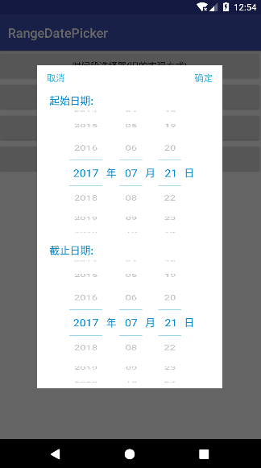
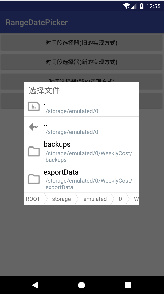

# DateRangePicker-FilePicker
一份基于[AndroidPicker](https://github.com/gzu-liyujiang/AndroidPicker)的拓展，时间段选择器和文件选择器

时间段选择器有两种实现方式，一个是基于1.1.0版修改，一个是基于1.5.4修改，实现结果差不多，早期的不支持设置end时间

    //初始化选择器 第二个参数如果为false则只是年月日选择器，而不是年月日时间段选择器
    DateRangePicker picker = new DateRangePicker(this, YEAR_MONTH_DAY, true);
            //选择器
    picker.setGravity(Gravity.CENTER);
    picker.setDateRangeStart(1997, 1, 1);
    picker.setDateRangeEnd(2030, 12, 30);
    picker.setTextSize(16);
    picker.setSelectedItem(year(), month(), day());
    picker.setSelectedSecondItem(year(), month(), day() + 1);
    picker.setOnDatePickListener(new DateRangePicker.OnYearMonthDayDoublePickListener() {
            @Override
        public void onDatePicked(String startYear, String startMonth, String startDay, String endYear, String endMonth, String endDay) {
                 String dateStart = startYear + "-" + startMonth + "-" + startDay;
                    String dateEnd = endYear + "-" + endMonth + "-" + endDay;
                    showToast("起始日期" + dateStart + "\n" + "截止日期" + dateEnd);
                }
        });
        picker.show();
</img>

文件管理器，稍微修改了下，使用大致和gzu-liyujiang的[Filepicker](https://github.com/gzu-liyujiang/AndroidPicker)一样

    FilePicker picker = new FilePicker(this, FilePicker.FILE);
        picker.setShowHideDir(false);
        picker.setShowHomeDir(true);
        picker.setShowUpDir(true);
        picker.setGravity(Gravity.CENTER);
        String rootPath=Environment.getExternalStorageDirectory()+"";
        picker.setRootPath(rootPath);
        picker.setAllowExtensions(new String[]{".csv"});
        picker.setOnFilePickListener(new FilePicker.OnFilePickListener() {
            @Override
            public void onFilePicked(String currentPath) {
                showToast(currentPath);
            }
        });
        picker.show();
</img>

更多见源码。。在此感谢原作者->(https://github.com/gzu-liyujiang/AndroidPicker)

由于频繁搬动，文件头的注释声明有可能已经没有了，表示抱歉！